<!--

## Real time update

-->

## Hi, Friends. 👋  
<!--
**samzong/samzong** is a ✨ _special_ ✨ repository because its `README.md` (this file) appears on your GitHub profile.
Here are some ideas to get you started:
- 🔭 I’m currently working on ...
- 🌱 I’m currently learning ...
- 👯 I’m looking to collaborate on ...
- 🤔 I’m looking for help with ...
- 💬 Ask me about ...
- 📫 How to reach me: ...
- 😄 Pronouns: ...
- ⚡ Fun fact: ...
-->
<!-- 

  

<table cellspacing="0" cellpadding="0">
  <tr align="center" valign="middle">
    <td></td>
    <td></td>
  </tr>
</table>
-->

<!-- 

  

 -->
