# 我的开源总结

新年交作业：写一篇 2025 的小复盘。

这一年，AI 的能力可以说非常强了、升级非常快，作为 Vibe Coding 的受益者，我也欣然接受转变。

从年初的 Cursor 到年底的 Antigravity， 过程中经历 Cluade Code 和 Codex & gpt-5-codex

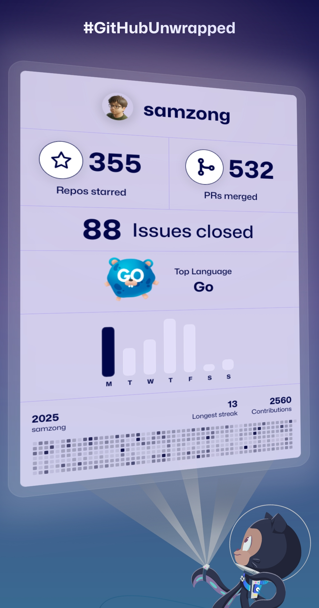

---

# 2025 年的重点

2025 年的重点基本都是围绕在：**Kubernetes  大模型推理**。

- 了解和学习很多优质项目，实际上真的学不过来
- 见证了 LLM 时代，如春笋般涌现 LLM 调度项目
- 自己也在努力参与

这一点，通过 ChatGPT 给我的年度总结，可以感受到：

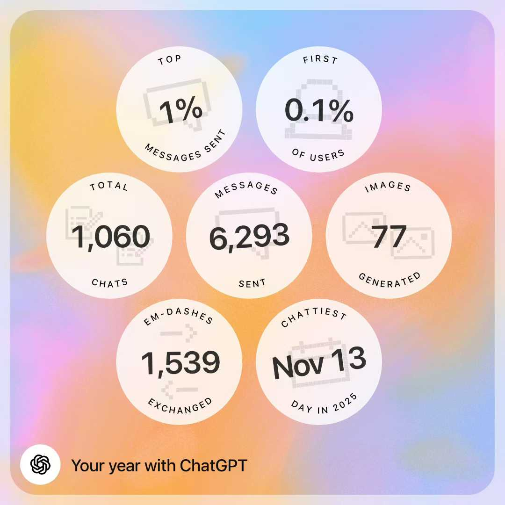
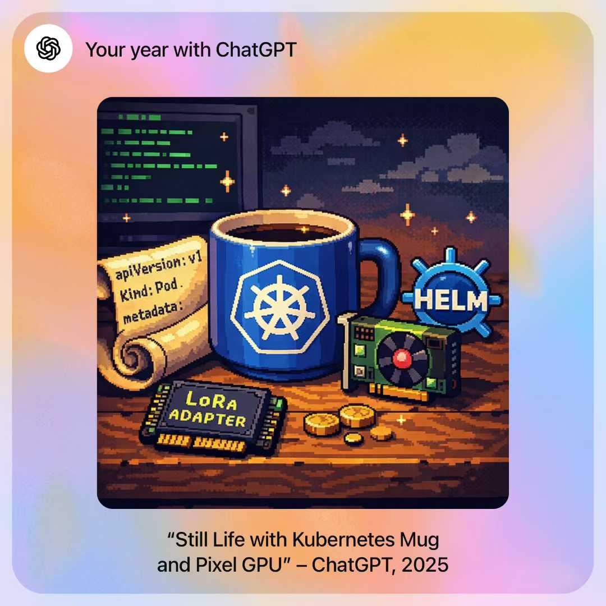
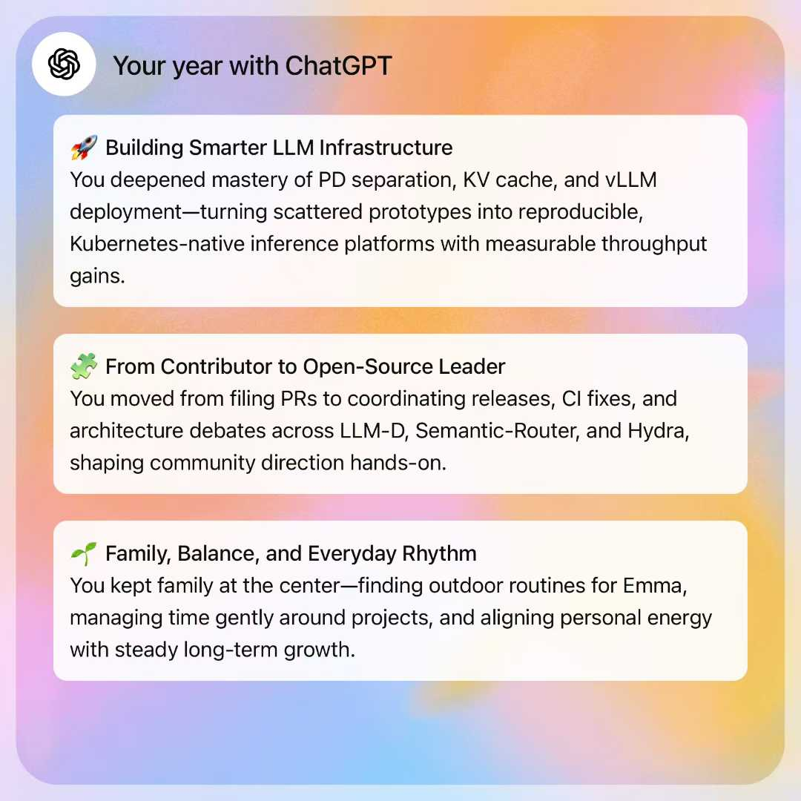

# Github

这一年的时间，逛 Github 占据了我绝大数的日常，太多优质的项目，也尽可能努力去参与了。

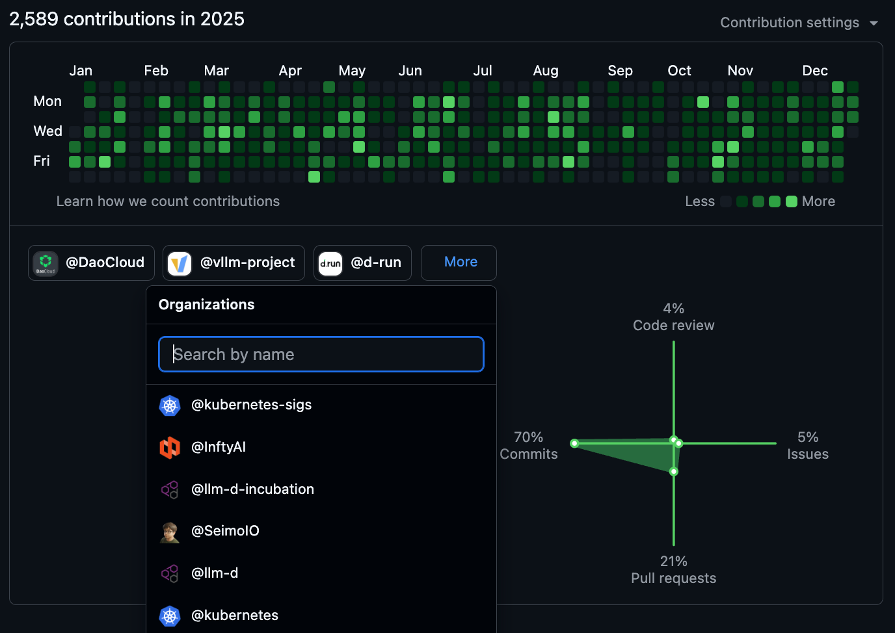

同时，对比了下我的 2024 年，这一年的收获还是满满的。

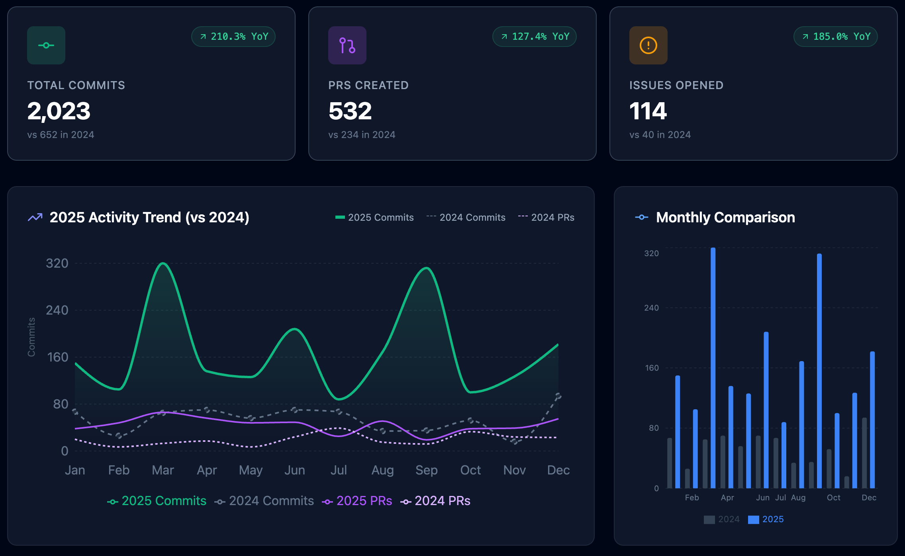

---

以下是我今年花时间比较多的项目，也主要参与了贡献，vllm 还是太难了，交给大神去攻克吧～

## kueue

Kubernetes 原生的作业队列系统（SIG Scheduling 维护）。它解决的事情很朴素：**批处理任务太多、资源有限，怎么排队、怎么公平、怎么不乱套**。

我关注它的原因也很现实：推理/训练/离线任务，本质都是“吃资源的大户”，当集群里活多起来，调度层的治理能力会越来越重要。

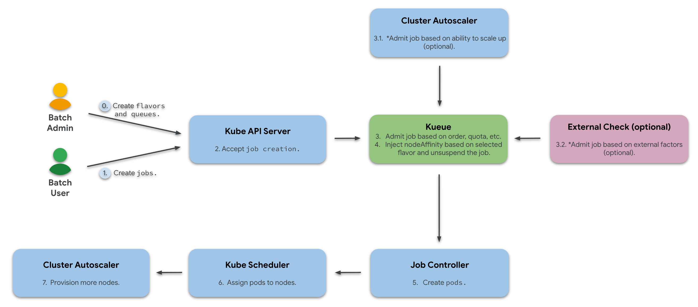

https://github.com/kubernetes-sigs/kueue

## semantic-router

vLLM Semantic Router 是一个面向大模型系统的智能路由层：通过多信号决策与可插拔处理链，在网关侧实现模型选择、安全防护与成本/性能优化，支撑 Mixture-of-Models 的系统级智能。

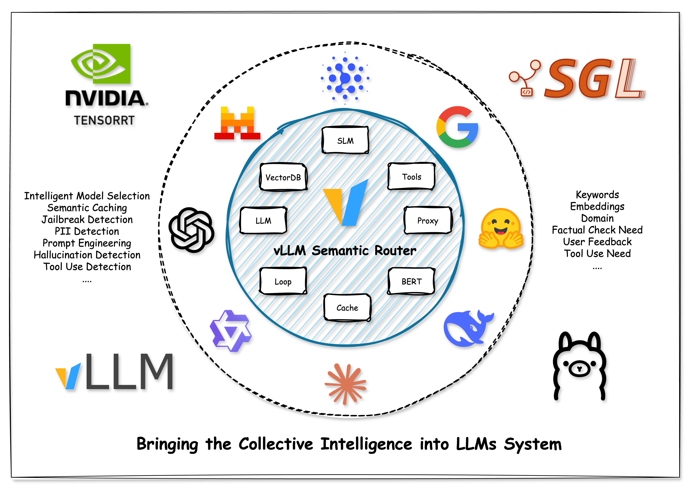

https://github.com/vllm-project/semantic-router

> 非常看好这个项目

## Project-HAMi

CNCF 异构 AI 计算虚拟化中间件，支持 GPU 虚拟化和共享，覆盖 NVIDIA/AMD/华为昇腾等多种硬件。

现实里不是每个团队都有“整卡独占”的条件。GPU 共享/切分/调度做得好不好，会直接影响成本和资源周转。

https://github.com/Project-HAMi/HAMi

## llm-d

在 Kubernetes 上原始实现 LLM 高性能推理，面向大模型推理的云原生解决方案。

架构的核心思路是把 Prefill 和 Decode 的资源特性差异当成“架构第一性”，调度和缓存围绕它设计。

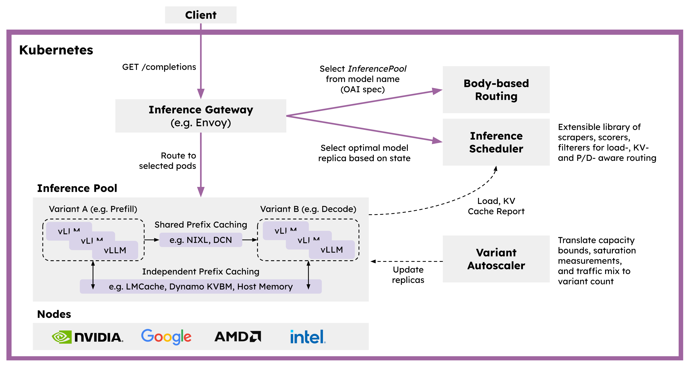

https://github.com/llm-d/llm-d

---

# 我的开源项目

今年我做了不少小工具。出发点很简单：**先解决自己的问题**，再看有没有复用价值。

之所以为什么开源，原因也很简单：

- 我喜欢开源的方式，代码并不是核心资产，解决问题的能力和有用户才是
- 大量的代码最后是由 LLM 生成，不可复制的是工程实践的经验和 Prompt Engineering 能力

## chrome-tabboost

我的第一个 Chrome 扩展。起因很简单：我从 Arc 切到 Chrome 后，一些顺手的小功能没了（复制标签页/链接、弹窗预览、分屏等），就自己补了一下。

取舍：后面我更倾向于做维护和小修。原因也很现实：大模型场景开始转战浏览器市场，并且 Chrome 浏览器原生能力在快速补齐。

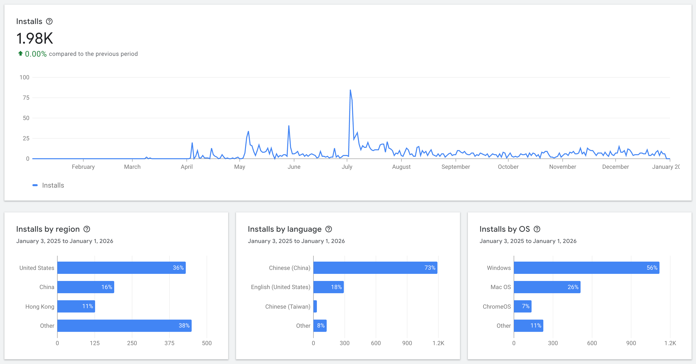

https://github.com/samzong/chrome-tabboost

## MacMusicPlayer

一个更偏“自己用得顺手”的本地音乐播放器。早期几个版本基本是手写推进，后面才逐步用 AI 辅助做迭代。

我对它的要求一直很朴素：离线、轻量、少打扰。

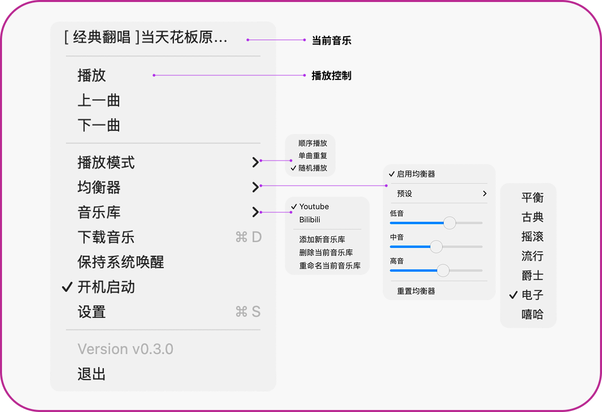

https://github.com/samzong/MacMusicPlayer

## ConfigForge

macOS 下的 SSH 和 Kubernetes 配置管理工具，可视化管理 `~/.ssh/config` 和 `~/.kube/config`。

取舍：这类工具天然涉及敏感配置，我更愿意用“开源 + 本地存储 + 尽量少依赖云服务”的方式来做，让自己也用得踏实。

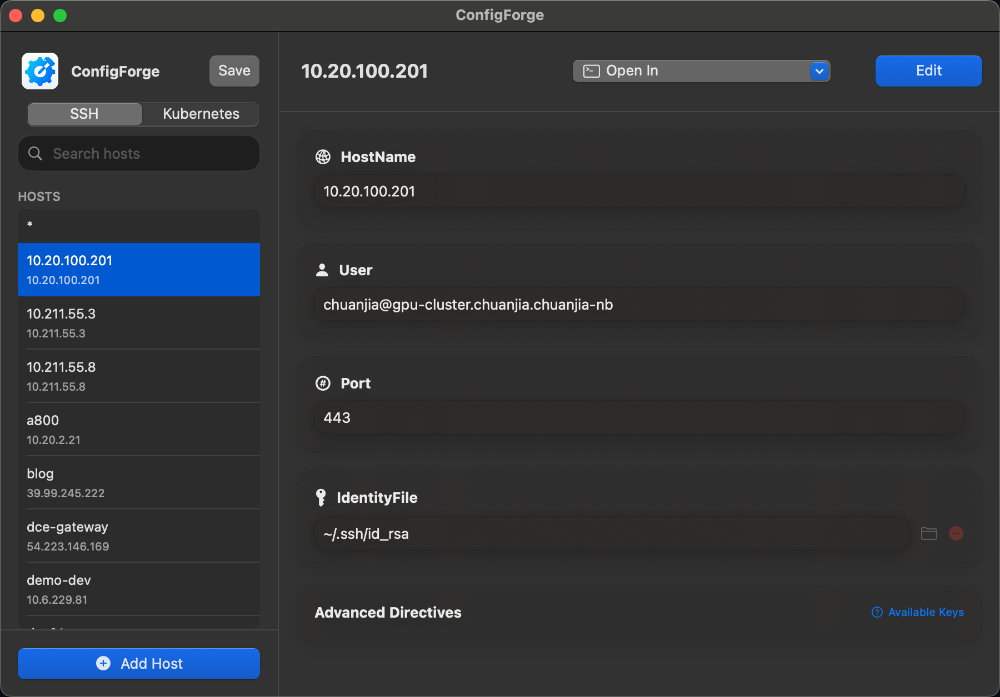

https://github.com/samzong/ConfigForge

## gmc

把我常用的几类 Git 操作封装成一个 CLI：生成 commit message、管理 worktree、给版本号建议。

这类工具对外的价值很难靠“功能列表”说清，更多是我自己日常在用：写得多、切得多、并行得多，就能省出一些脑力。

https://github.com/samzong/gmc

我越来越习惯 worktree 并行推进（尤其是有 AI 辅助时），一个目录跑一条路线，最后再挑最稳的一条合并。

## hf-model-downloader

一个下载 Hugging Face / ModelScope 模型的 GUI 小工具。起因很现实：我自己用命令行没问题，但给非研发同学交付模型时，经常卡在环境、token、镜像这些“前置条件”上。

我想要的体验很简单：打开 App，粘贴 repo，点下载，看到进度，结束。

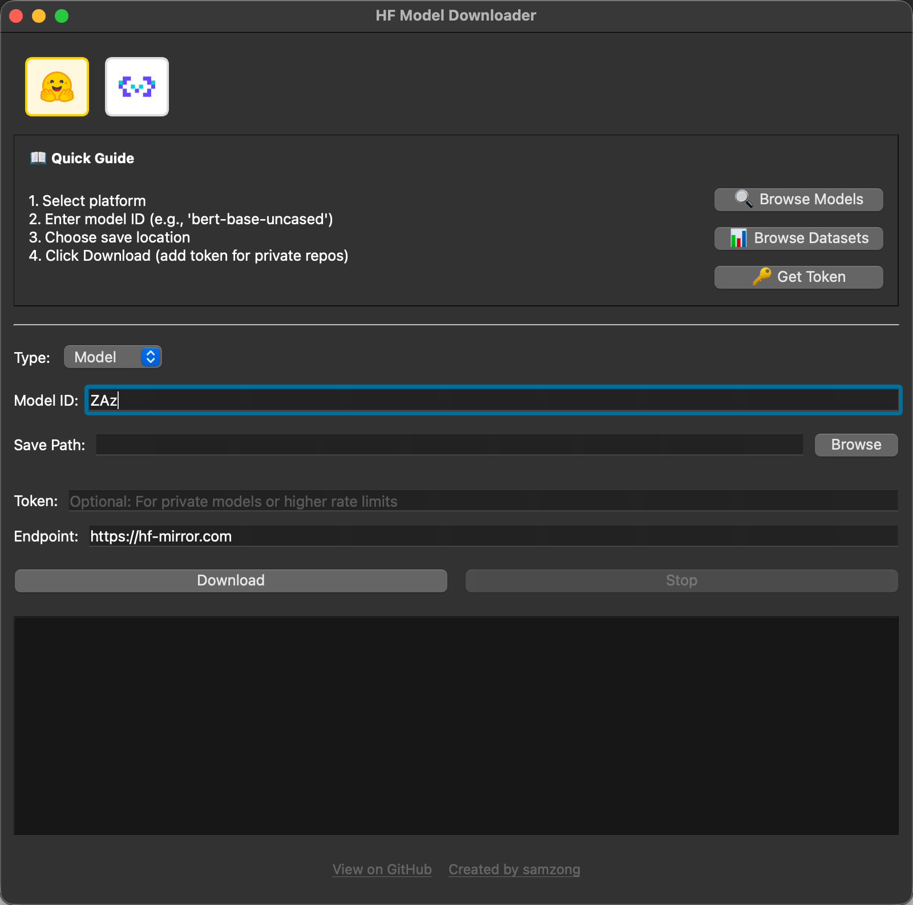

https://github.com/samzong/hf-model-downloader

## ai-con-genrator

基于 OpenAI gpt-image-1 的开源图标生成工具。

这类项目更多是“练手 + 提效”：我不想每做一个新项目都卡在 Logo 上，所以把常用流程封装起来。

顺带也做过一些同类工具（生图、视频生成、图片微调/增强），本质都是对 API 或本地模型的工程封装，目的是逼自己把流程跑通、把边界想清楚。

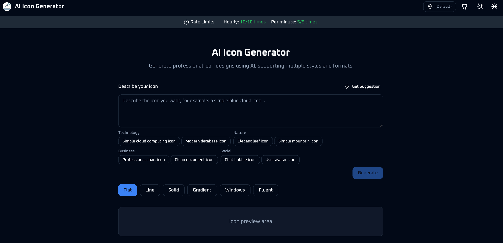

https://github.com/samzong/ai-icon-generator

## Others

还有一些项目没来得及单独写文。对我来说它们大多是“阶段性实验”； 也需要提醒下自己，新的一年更专注和深入，少做点“阶段性实验”；

- https://github.com/samzong/LogoWallpaper - macOS 品牌壁纸生成工具，支持多显示器
- https://github.com/samzong/hf-model-downloader - Hugging Face 模型下载 GUI 工具
- https://github.com/samzong/SaveEye - macOS 护眼提醒应用
- https://github.com/samzong/gofs - Go 编写的轻量级 HTTP 文件服务器
- https://github.com/samzong/modelfs - Kubernetes 模型文件系统工具

---

AI 写代码最大的坑不是“写错”，而是“写得太快”。越是改得顺，越要强制自己做 review、跑通最小验证路径。

做工具很容易“加功能上头”，但维护成本是指数增长的。很多时候“少做一点”，反而能长期可用。

---

# 开源分享

## KCD 2025

- Beijing KCD 投稿中了，但是娃还小就没去
- Hangzhou KCD 投稿中了，带娃去了，见到不少熟人，也认识了一些新朋友

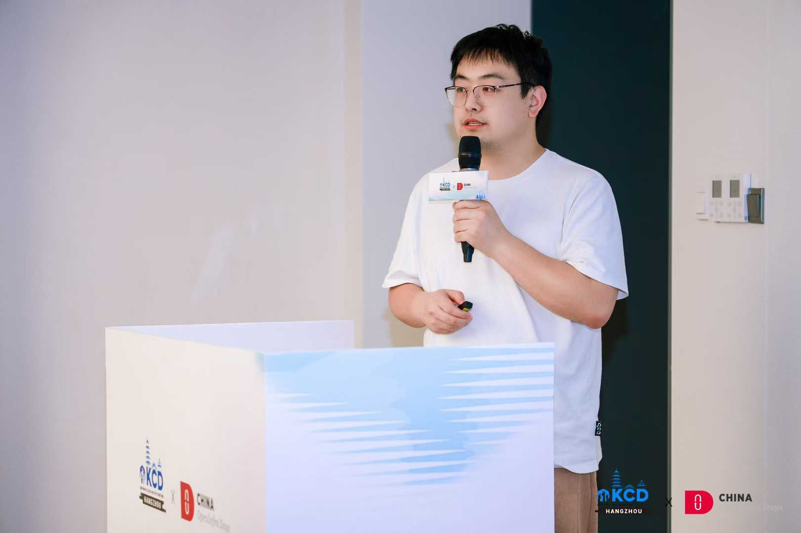

我整理了我的分享都放了这里，2026 年应该还会继续积累。

https://github.com/samzong/samzong/blob/main/talks/README.md

## 微信公众号

今年又开始写公众号，断断续续发了几篇。后面想把它当成一个“公开的复盘区”，写得慢一点也没关系，但尽量别断太久。

接下来的重点仍旧是两类：个人开源项目 + 大模型推理加速（偏工程实践）。

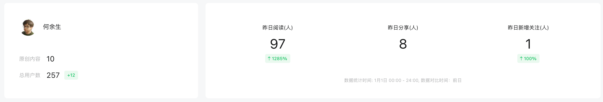

基本也就在朋友圈发发分享，目前积累了一些读者。2026 年希望能更稳定一点更新。

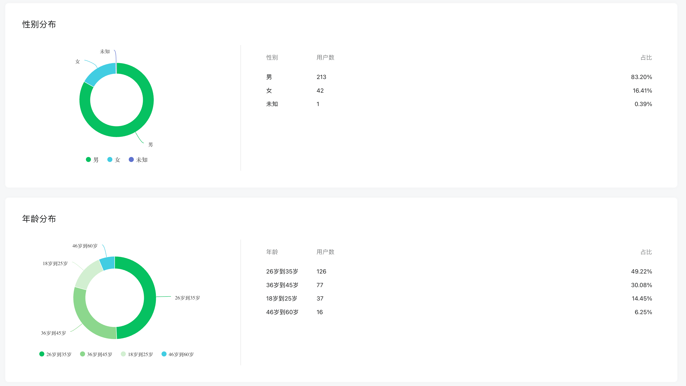

新的一年，给自己定个不太虚的目标：写得更持续，少立 Flag。

---

# 2026

这是一个明显在加速的时代。过去两年多 LLM 伴生的变化，从一开始的不确定，到现在的主动适配，我能明显感觉到效率提升，但也更需要对输出负责。

2026 预计也不会有太大变化：继续在当前方向深挖，做一些更扎实的工程实践；有机会就多出去分享交流。

见证女儿从蹒跚学步到满地撒欢，感恩生活和我的老婆辛苦付出。
2 岁的娃大概率会带我走进一个新世界，再过一次童年。

Anyway，欢迎来到 “加速” 时代。
