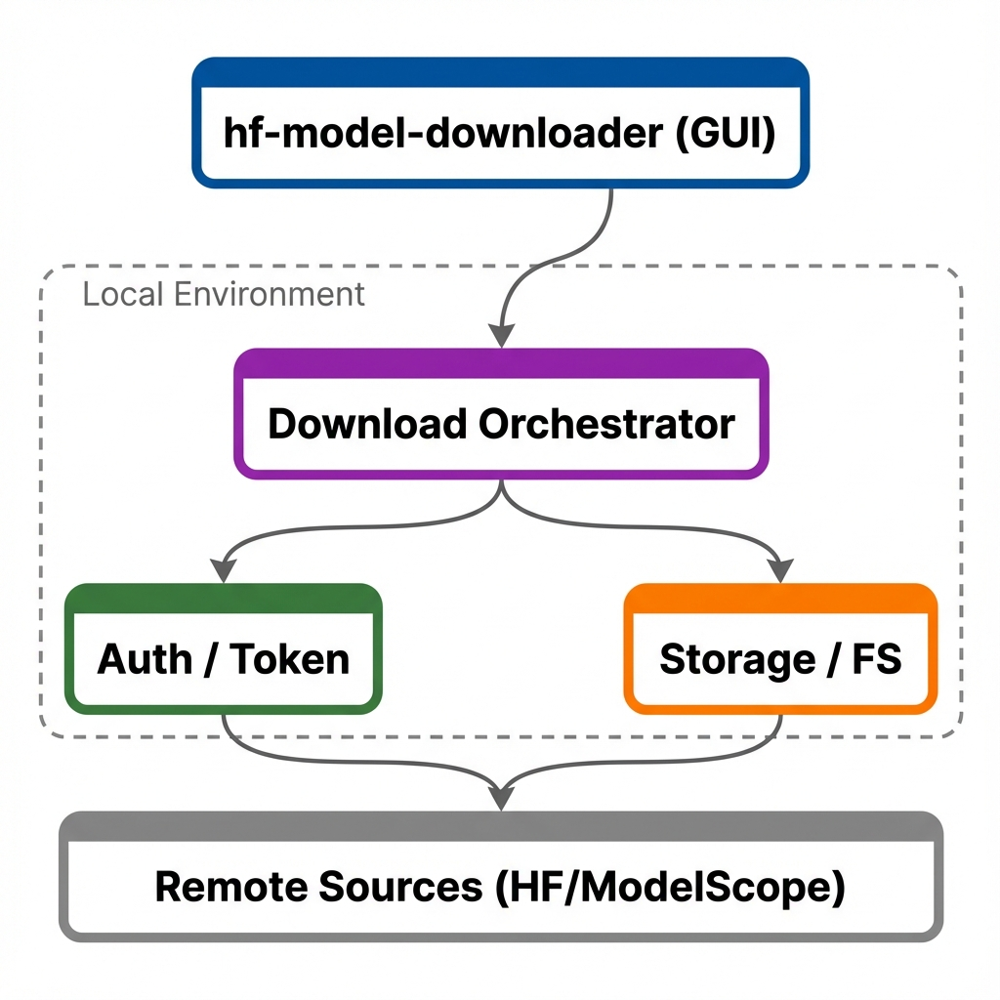

# 不用敲命令，也能下载 Hugging Face 模型：我做了个 GUI 下载器


**Downloads models from Hugging Face and ModelScope. Has a GUI so you don't need to mess with command lines.**

项目地址：https://github.com/samzong/hf-model-downloader  
下载入口（Releases）：https://github.com/samzong/hf-model-downloader/releases

说一个暴论：**“下模型”这件事，可能要比“用模型”更折腾**。

在国内很多场景下，部署模型服务都是在离线场景。没办法直接用 `hf-mirror.com` 在线拉取。

所以，当你想要下载一个模型时：

- 你需要知道 huggingface-cli
- 你需要有一个 Python 环境 (配置 Python 本来就麻烦)
- 你需要配置 HF_ENDPOINT 和 HF_TOKEN
- ...

对于只是想获取一个模型还是非常麻烦的，所以我做了一个小工具：**hf-model-downloader**，一个跨平台 GUI 应用，
用来下载 Hugging Face / ModelScope 的模型权重。

[此处需要动图/短视频：从输入 repo → 点击下载 → 进度条跑完（30 秒内）]

---

# **01**

## 缘起：为什么要做这个

我自己平时主要用命令行（`huggingface-cli`）下载模型，但是发现其他人（非研发）总是卡在环境上；所以经常是要下载好传给他们，而且模型权重一般很大，走原始的移动硬盘数据拷贝需要线下加面。

这其实是 `huggingface`这类工具的一个痛点：**对“第一次用的人”不友好**。

1. 需要装一堆环境，解释成本很高（尤其是给非技术同学用）
2. token/权限问题一旦报错，信息不直观
3. 下载过程不可见（到底在下没下？卡住没？）
4. 最后你会发现：你不是在“下载模型”，你是在“做运维”

我想要的体验很简单：**打开一个 App，粘贴模型路径，点下载，看到进度，结束。**

---

# **02**

## 功能定位


hf-model-downloader 的核心定位就是一句话：**把模型下载变成一个“人人看得懂”的动作**。

主要能力：

- **GUI 下载**：不用命令行也能下载 Hugging Face / ModelScope 模型
- **Token 管理**：需要鉴权的模型，直接在界面里配置
- **下载进度可视化**：你能明确看到在下什么、速度多少、剩余多少
- **跨平台**：Windows / macOS / Linux 都能用
- **开箱即用**：发布的是可运行应用（不是“先装 Python 再说”那种）

如果你是工程师（顺带满足一下“专业口味”），你会懂我在解决什么：**把“下载权重”这件事从脚本化变成产品化**。

[此处需要图片：Token 设置/鉴权设置页面截图（强调“非技术也能懂”）]

---

# **03**

## 使用方法

最短路径就三步：下载、运行、填参数。

```bash
# 1) 打开 Releases 下载对应系统安装包
https://samzong.github.io/hf-model-downloader/

# 2) 安装并运行应用
# 3) 在界面里填写：模型来源（HF/ModelScope）、repo、token（如需），点击 Download
```

[此处需要图片：下载页（Releases）截图，标出“选择对应系统版本”]

如果你需要给团队同学写“傻瓜式说明”，可以直接复制这一句：

- “去 https://samzong.github.io/hf-model-downloader/ 下最新版，打开 App，填 repo，点下载，等进度条跑完就行。”

[此处需要图片：一次真实下载示例（例如某个公开模型 repo + 下载完成状态）]

---

# **04**

## 技术实现

项目本身也支持本地开发/构建（想贡献代码或者自己魔改都行）：

```bash
git clone https://github.com/samzong/hf-model-downloader.git
cd hf-model-downloader

# 推荐方式：uv
uv sync
uv run main.py
```

构建相关（如果你要自己打包）README 里也有 Makefile 入口。

[此处需要架构图：下载流程/模块分层（GUI → Auth/Token → Downloader → 本地存储 → 进度回传）]

下面是对应的**低保真文本绘图**（你可以直接丢给 AI 生图，让它照着画成更好看的架构图）：




[此处需要图片：开发运行截图（本地启动界面 or 终端启动日志二选一）]

---

# **05**

## 写在最后

我做这个工具的目标不是 “替代所有命令行方案”，而是提供一个更适合**分享、交付、复用**的下载方式：

如果你觉得使用 `huggingface-cli` 就像喝水一样简单，那么这个工具可能不是你的菜。

如果你觉得使用 `huggingface-cli` 就像“做运维”一样复杂，那么这个工具就非常适合你。

---

如果你用起来顺手，欢迎来 GitHub 留个反馈 / 提 issue / 点个 Star。
