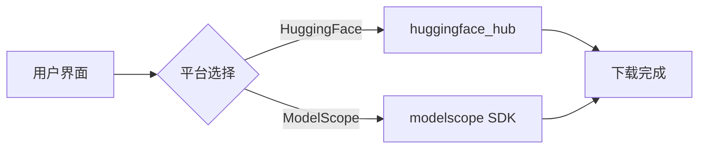
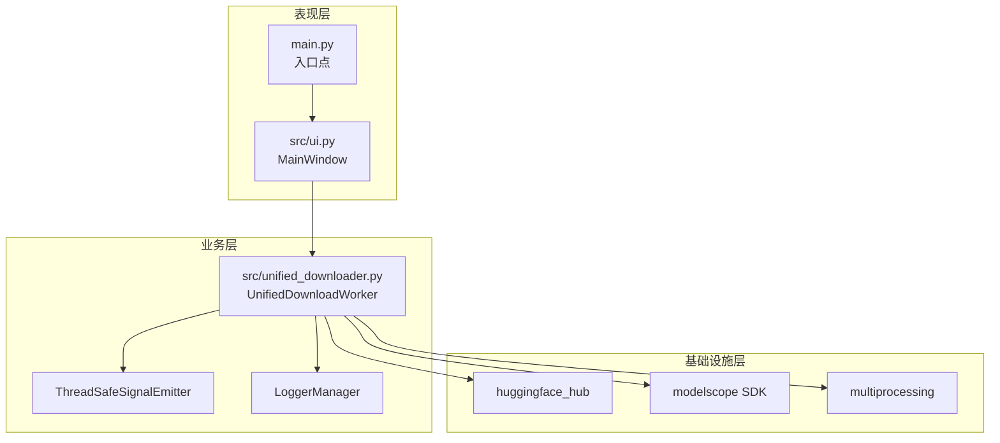
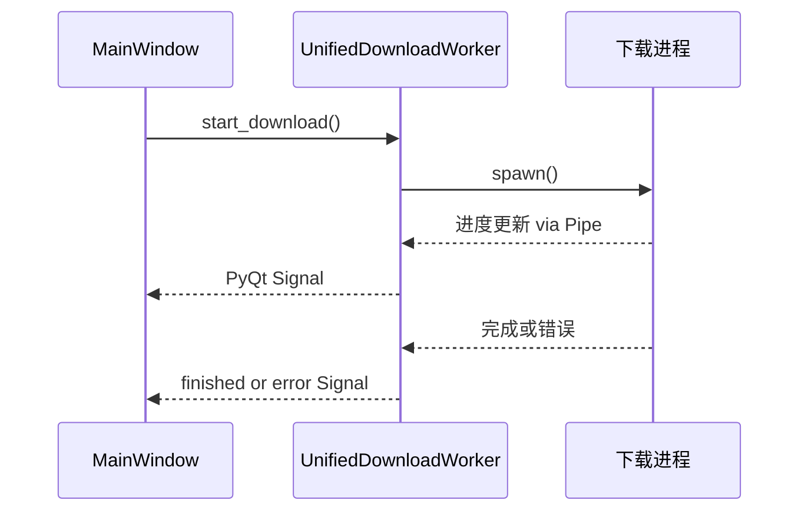
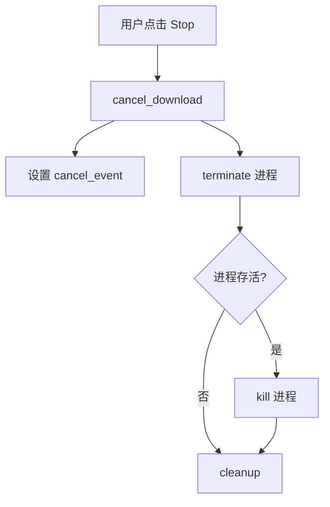
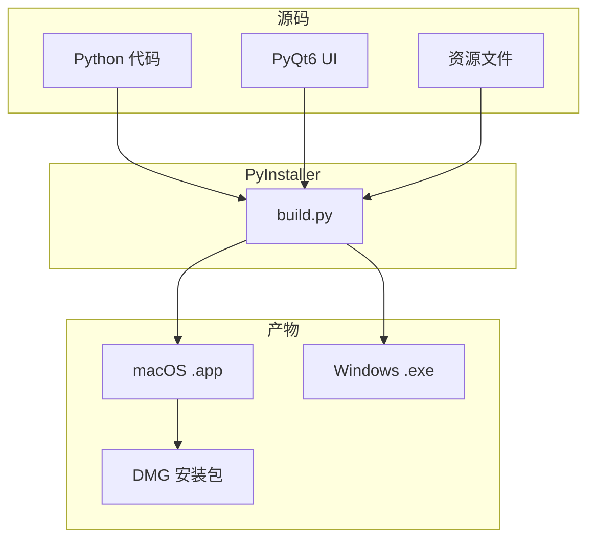

# 不用敲命令也能下载 Hugging Face 模型


项目地址：https://github.com/samzong/hf-model-downloader

下载入口：https://github.com/samzong/hf-model-downloader/releases

说个暴论，下模型这事可能比用模型更折腾。

国内很多场景部署模型服务都是离线环境，没法直接用 hf-mirror 在线拉取。你想下载一个模型，得先知道 huggingface-cli 是什么，得有 Python 环境，还得配置 HF_ENDPOINT 和 HF_TOKEN。光是给人解释这些概念，就够喝一壶的。更别提有些模型还需要申请权限，token 配错了报错信息又不直观，排查起来全靠猜。

所以我做了 hf-model-downloader。一个跨平台的 GUI 应用，用来下载 Hugging Face 和 ModelScope 的模型权重。

## 为什么做这个

我平时用命令行下载模型习惯了，但发现其他人总卡在环境配置上。尤其非研发的同学，让他们装 Python、配环境变量，基本等于劝退。所以经常变成我下载好再传给他们，模型权重动辄几十个 G，走移动硬盘还得专门约时间线下见面拷贝。

huggingface-cli 这类工具对第一次用的人确实不友好。你得装一堆依赖，Python 版本还得对得上。token 权限报错了，提示信息一大串，新手根本看不懂。下载过程也是黑盒的，进度条没有，到底在下没下、卡住没有、网络断了没有，完全看不出来。折腾半天你发现自己其实在做运维，而你本来只是想下载一个文件。

我想要的体验很简单。打开一个 App，粘贴模型路径，点下载，看着进度条走，走完就行。中间不需要任何额外知识。

## 功能特性


hf-model-downloader 就是把模型下载变成一个谁都能看懂的动作。

有 GUI 界面，不用命令行也能下载 Hugging Face 和 ModelScope 上的模型。Token 在界面里直接配，需要鉴权的私有模型也能处理，不用在终端里折腾环境变量。下载进度可视化，你能看到当前在下哪个文件、速度多少、还剩多少时间。支持断点续传，网断了重新打开继续下就行。Windows macOS Linux 都能用，发布的是打包好的可运行应用，双击就能打开，不用先装 Python。

下面这张图是双平台支持的逻辑。用户选择平台后，底层会调用对应的 SDK 去拉取模型。



如果你是工程师，你会懂这解决的是什么问题。命令行脚本能干的事，给它包一层界面，让更多不熟悉命令行的人也能用上。

## 怎么用

下载，运行，填参数。

去 Releases 页面下载对应系统的安装包：

https://samzong.github.io/hf-model-downloader/

安装好之后打开应用，界面里选择模型来源是 Hugging Face 还是 ModelScope，填上 repo 地址，如果需要的话填上 token，点 Download 就开始了。下载完的模型会存到你指定的目录。

```bash
# 界面操作流程
# 选择来源 → 填 repo → 填 token（可选）→ 点 Download
```

给团队同学写说明可以直接复制这句：去 https://samzong.github.io/hf-model-downloader/ 下最新版，打开 App，填 repo，点下载，等进度条跑完就行。

## 技术架构

聊聊底层实现。整个应用分三层：表现层是 PyQt6 的 MainWindow，业务层是 UnifiedDownloadWorker 负责协调下载流程，基础设施层调用 huggingface_hub 和 modelscope 的 SDK。



一个核心设计决策是用多进程而不是多线程。原因很简单，Python 有 GIL 限制，huggingface_hub 的内部状态也不是线程安全的。如果用多线程，下载的时候 UI 还是会卡。用多进程的话，下载操作在独立进程里跑，UI 进程完全不受影响。



进程间通信用的是 Pipe。下载进程通过 SafePipeWriter 把进度信息写到管道里，Worker 线程读取后转成 PyQt 信号发给 UI。为什么要包一个 SafePipeWriter？因为 SDK 的进度回调可能在多个线程里触发，需要加锁保护管道写入。

下载取消也得考虑。用户点停止的时候，会先发 SIGTERM 给下载进程让它优雅退出，等 5 秒还没退就发 SIGKILL 强制杀掉。



平台抽象没有用什么设计模式，就是一个配置字典。新增平台只需要在 PLATFORM_CONFIGS 里加几行配置，不用改核心逻辑。只有两个平台，搞接口继承是过度设计。

```python
PLATFORM_CONFIGS = {
    "huggingface": {
        "token_env": "HF_TOKEN",
        "endpoint_env": "HF_ENDPOINT",
        "logger_name": "huggingface_hub",
        "default_endpoint": "https://huggingface.co",
    },
    "modelscope": {
        "token_env": "MODELSCOPE_API_TOKEN",
        ...
    },
}
```

还有个细节，为什么用 spawn 而不是 fork 启动子进程。macOS 上 PyQt 和 fork 一起用可能会 crash，spawn 会启动一个全新的解释器，更安全。PyInstaller 打包后也需要显式设置 spawn 方法才能正常工作。

## 本地开发

项目完全开源，支持本地开发和构建。想贡献代码或者自己魔改都没问题。

```bash
git clone https://github.com/samzong/hf-model-downloader.git
cd hf-model-downloader

# 推荐用 uv 管理依赖
uv sync
uv run main.py
```

打包用的是 PyInstaller。build.py 里有构建脚本，Makefile 也封装了常用命令。CI/CD 会自动打包 macOS 的 .app 和 DMG、Windows 的 .exe。



目录结构长这样：

```
hf-model-downloader/
├── main.py                 # 入口点：多进程初始化、图标加载
├── src/
│   ├── ui.py               # MainWindow 类
│   ├── unified_downloader.py # 统一下载引擎 (核心)
│   ├── resource_utils.py   # 资源路径处理
│   └── utils.py            # 清理工具
├── assets/                 # 图标和 Logo
├── build.py                # PyInstaller 构建脚本
├── Makefile                # 构建命令
└── .github/workflows/      # CI/CD 流程
```

## 最后

做这个工具是想提供一个适合分享和交付的下载方式。有时候你只是想帮别人下个模型，或者给不熟悉命令行的同事提供一个能用的方案，这工具就派上用场了。

你要是觉得用 huggingface-cli 就像喝水一样简单，这工具可能不是你的菜。但如果每次下模型都感觉在做运维，或者你自己没问题但总要帮别人解决环境问题，可以试试把这个工具丢给他们。

用着顺手的话，欢迎来 GitHub 留个反馈或者点个 Star。有问题也可以直接提 issue，我会看的。
