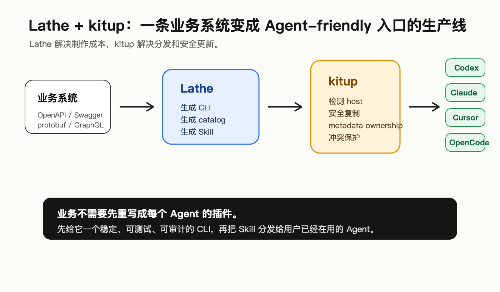
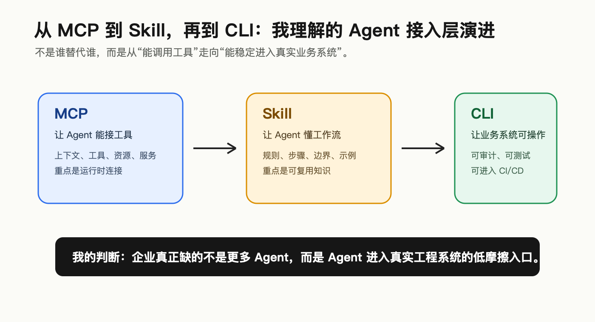
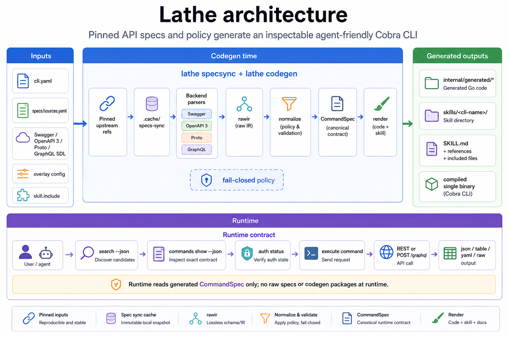
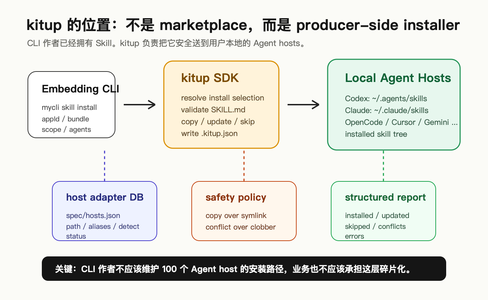

# Lathe 给旧世界的礼物



项目地址：
https://github.com/lathe-cli/lathe
https://github.com/samzong/kitup

这段时间我一直在想一个问题：

**Agent 怎么才能进入真实业务系统？**

不是让大模型调一个天气 API，也不是在 IDE 里帮我改几个文件，生产一段代码。

而是进入那些真实的业务系统、API 平台、运维工具、数据服务、部署系统。

我的理解是：

> AI Native 时代，一定会遇到**大量 Agent 和真实业务系统**对接的问题。

这个问题现在看起来还不明显，是因为很多团队还停留在**让 Agent 写代码**阶段。

当 Agent 开始不只是写代码，而是要真的操作系统、查状态、跑流程、改配置、触发发布、分析业务数据：

- Agent 该怎么知道有哪些能力？
- 它怎么知道哪个参数必填？
- 它怎么知道这个操作要不要登录？
- 它怎么知道输出里哪些字段可信？
- 它怎么避免靠猜子命令、猜路径？
- 它怎么在 Codex、Claude Code 等 Agent 里都能用？

这就是我做 **Lathe** 和 **Kitup** 的背景。

> **降低 Agent 进入真实世界的摩擦。**

---

## 迭代

`MCP` 应该是这轮 AI Coding 的基础设施演进，最先兴起，然后就是 `Skill`，到现在的 `CLI`:

```text
      MCP -> Skill -> CLI
``` 

这不是谁替代谁。它们解决的是不同层级的问题：

- `MCP`：解决运行时连接
- `Skill`：解决工作流认知
- `CLI`：解决真实系统的稳定操作入口



`MCP` 是一个开放协议，用于标准化如何给 LLM 提供上下文。这非常关键，因为 Agent 不可能永远只活在聊天框里，它必须连接外部工具、资源和服务。

`Skill` 更像是一套给 Agent 的操作手册。它告诉 Agent：

- 什么时候用这个工具
- 先读什么
- 哪些命令安全
- 哪些路径不要碰
- 输出怎么解释
- 失败时怎么诊断

我之前已经写过一篇关于 `Agent Skills` 的分享。我的感受是：好的 Skill 不是 `prompt`，而是经过沉淀的工作流。

但继续深入，又遇到一个问题：

> Skill 里说得再清楚，如果底层业务系统没有一个稳定、可审计、可测试的操作入口，Agent 还是只能猜。

> 这，就是 CLI 的位置。

CLI 其实是一个非常老的东西，但在 Agent 时代反而重新变得重要。

因为 CLI 天然有几个适合企业系统的特点：

- 可以进 CI
- 可以测试
- 可以审计
- 可以做权限边界
- 可以输出 JSON
- 可以稳定版本化
- 可以被人和 Agent 同时使用

> 旧世界的业务系统如何 **Agent-friendly**，**CLI + Skill** 是一套非常优雅的组合。

---

## 为什么需要 Lathe

https://github.com/lathe-cli/lathe

是否每个业务系统都自己写一个 CLI 就行了？

现实是：**写得起，维护不起**；并且多年的旧业务系统本来已经有 API：

- OpenAPI
- Swagger
- Protobuf
- GraphQL

但对应的 CLI 往往是后补的；一开始手写几个命令还行，后面问题会越来越多：

- API 改了，CLI 没同步
- 文档改了，Skill 没同步
- help 文案能看，但 Agent 解析不了
- 命令能跑，但不知道 `auth` / `body` / `output contract`
- 有些命令是危险操作，但 `catalog` 里没有明确标识
- 同一个系统里 REST、GraphQL、proto 混在一起

人类可以靠经验和搜索兜底，Agent 不行。

Agent 最怕的不是“不会”，而是“自信地猜”。

### API to CLI

**Lathe** 要解决的就是这个问题：

> 从已有 API 契约生成 **Agent-friendly** 的 CLI，**让 Agent 不靠猜**。



- **生成阶段**：
    读取 `specs/sources.yaml`，同步 OpenAPI / Swagger / Protobuf / GraphQL，统一进 Raw IR，再 normalize 成 `runtime.CommandSpec`，最后渲染成 generated Go code 和 Skill。
- **运行阶段**：
    用户拿到的是一个单二进制 CLI。它背后有 `Cobra command tree`、`HTTP request builder`、`auth`、`formatter` 和 `catalog`。

这里最关键的缝合点是：

```text
internal/generated/<module>/<module>_gen.go
```

也就是每个 module 生成出来的 `[]runtime.CommandSpec`。

这个设计对 Agent 很重要。因为 Agent 不应该直接读一坨人类 `help text` 再猜怎么调用。它应该先读 `catalog`，再读单个 `command` 的精确契约，然后再执行。

**Lathe** 做的不是普通 `API wrapper`，而是生成 CLI 及其配套、Agent 可读的结构化入口：

- `search "<intent>" --json`：先按意图找候选命令
- `commands show <path...> --json`：执行前读取精确命令契约
- `commands schema --json`：读取 `catalog` schema，避免解析漂移
- `skills/<cli-name>/`：生成 Agent Skill，让 Agent 知道如何使用这个 CLI

也就是说，**Lathe** 不是只生成一个“人能用”的命令行。

它生成的是一套人和 Agent 都能用的接口层。

我更喜欢把它理解成：

> **Lathe** 把旧世界 API 产品转换成 Agent-ready Native CLI 产品。

这个定位很重要！它不是为了炫技，它解决的是制作成本问题。

如果一个业务系统已经有 API spec，那么我们不应该再手写一套容易漂移的 CLI 和 Skill，而应该尽量从源头生成。

### MAKE CLI BETTER AGAIN

但真实世界的 `API spec` 往往不会刚好长成一个好用的 CLI。

但如果每次都去改生成出来的代码，那 **Lathe** 的价值不存在了：

- 生成代码会漂移
- 下次 codegen 会覆盖
- CLI 和 API spec 的关系变得不可追踪
- Agent 看到的 `catalog` 也容易和真实实现不一致

所以 **Lathe** 里有一层 **Overlay**。

它更像是：**在 codegen 阶段，对 API spec 生成出来的命令做一层可复现的产品化润色。**

你可以在 `internal/overlay/<module>.yaml` 里这样写：

```yaml
defaults:
  pagination:
    match_commands: ["list-*", "query-*"]
    params:
      page: "1"
      pageSize: "20"
commands:
  create-user:
    use: create
    short: "Create a user in the IAM service"
    aliases: [adduser]
    example: |
      acmectl iam create \
        --set email=alice@example.com \
        --set role=viewer
    params:
      role:
        help: "User role: viewer, editor, or admin"
        default: viewer
```

然后在生成 CLI 时 **Overlay** 会被合并进生成出来的 `runtime.CommandSpec`。

它不只是改变 `--help`，它会同时影响：

- Cobra command tree
- `search --json`
- `commands show --json`
- generated `catalog`
- generated Skill

因为 Agent 最后不是读 Markdown 猜命令，而是读 `catalog` 和 `command` schema。

**Lathe** 当前 **Overlay** 适合做这些事：

- 改命令名和分组
- 加 aliases / shortcuts
- 补 short / long / example / structured examples
- 补参数 help / default / required
- 标记 hidden / ignore / deprecated
- 补 notes / prerequisites / known errors
- 批量补默认值

**Overlay** 只负责把**已经存在的 API 能力**变成更适合人和 Agent 使用的 CLI 表达。

我觉得这个边界很重要：

> `API spec` 决定“系统能做什么”，**Overlay** 决定“这个能力在 CLI 里怎么被优雅理解和使用”。

---

## 为什么需要 Kitup

https://github.com/samzong/kitup



**Lathe** 解决了 CLI 制作成本。

但制作出来之后，还有一个更碎的问题：怎么分发？

你生成了一个 CLI，也生成了一个 Skill。

那 Skill 要放哪？ 不同 Agent host 的路径并不一致：

- Codex 有自己的技能目录约定
- Claude Code 有自己的技能目录约定
- Cursor / OpenCode / Gemini CLI / Copilot CLI 也都在演进
- 有些支持项目级，有些支持用户级
- 有些路径兼容 `.agents/skills`
- 有些有自己的私有目录

**Kitup** 的架构其实也很简单，也很专注。

如果每个 CLI 项目都自己维护一遍安装逻辑，很快就会变成灾难。

假设 1000 个 CLI 项目，每个都要支持 100 个 Agent host，那就是 100000 次重复的路径决策。

而且这种逻辑不是简单 copy。

你还要处理：

- host detection
- user scope / project scope
- 安全确认
- update
- uninstall
- ownership metadata
- unmanaged conflict
- 多个 host 指向同一个目录时的去重
- structured report

这就是 **Kitup** 要解决的问题。CLI 只负责表达自己是谁、Skill 在哪里。

这件事看起来很小。

但真实落地里，它非常重要。

因为 **Agent-friendly** 入口不是“我生成了一个 Skill 文件”就结束了。

你必须能把它安全送到用户已经在用的 Agent 环境里。

**Kitup** 适配主流 `70+ Agent`，同时提供 `TS、Go、Rust` 三种 SDK。

---

## 使用方式

如果今天一个业务系统想变成 **Agent-friendly**，我会建议走这条路径：

```text
业务 API
  -> 整理 OpenAPI / Swagger / Protobuf / GraphQL
  -> Lathe 生成 CLI + catalog + Skill
  -> 构建并发布 CLI
  -> Kitup 把 Skill 安装到 Codex / Claude Code / Cursor / OpenCode
  -> Agent 通过 Skill 学会流程，通过 CLI 执行业务操作
```

**第一步** 先别急着写 Agent 插件。

先确认你的系统有没有稳定 API 契约。

如果没有，先补 API 契约。（或者你可以试试 `OpenCLI` ）

**第二步** 用 **Lathe** 配置 `cli.yaml` 和 `specs/sources.yaml`。

核心不是写代码，而是声明：

- 这个 CLI 叫什么
- API spec 从哪里来
- 哪些 GraphQL operation 要暴露
- `auth` 怎么验证
- 命令路径怎么组织
- 哪些 `help` / `example` 需要 **Overlay**

**第三步** 构建 CLI：

```bash
lathe bootstrap
go build -o bin/<cli-name> ./cmd/<cli-name>
```

生成之后，就可以让 Agent 执行。

```bash
<cli-name> search "create user" --json
<cli-name> commands show users create --json
<cli-name> commands schema --json
```

**第四步** 用 **Kitup** 在 CLI 里挂一个安装命令：

```text
<cli-name> skill install
```

用户装完后，Agent 不需要从零理解这个系统。

它已经有了：

- Skill：知道怎么使用这个 CLI
- `catalog`：知道命令事实
- CLI：真正执行操作
- `JSON output`：方便机器读取结果

---

## 写在最后

**Lathe** 和 **Kitup** 单独商业化都不是核心目标。

它们更像基础设施。

真正的价值是赋能业务产品：

> 让传统业务系统和新应用，都能快速拥有一个 **Agent-friendly** 入口。

这件事对平台团队、DevTools 团队、API-heavy 产品团队都有价值。

因为他们最终都会遇到同一个问题：

> 我的系统怎么被 Agent 安全、稳定、低成本地使用？

我越来越相信，未来很多企业产品都会需要这个入口。

不是因为它听起来先进。

而是因为 Agent 真的要干活，就必须进入真实系统。

而真实系统不会因为 Agent 出现，就自动变得好用。

这中间的摩擦，总要有人解决。