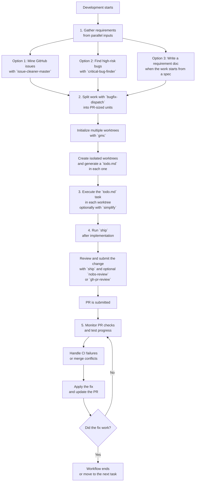

# Solo Vibe Coding

This workflow turns one large task into a set of small, reviewable PRs. It starts with parallel requirement gathering, fans out into isolated worktrees, and then loops through verification until each PR is ready to merge.

It is not a universal team workflow. It is a personal workflow that fits my solo, multi-worktree, LLM-assisted way of shipping changes.

In short:

- Gather requirements from issues, bug discovery, or a written spec.
- Split the work into small PR-sized tasks.
- Use multiple worktrees so each task can move independently.
- Ship each task through review and PR creation.
- Keep watching CI until the branch is clean and merge-ready.

## Stage-to-Skill Mapping

### 1. Gather requirements

- `issue-cleaner-master`: scan GitHub issues and rank which ones are worth picking up.
- `critical-bug-finder`: audit the codebase for production-grade bugs and generate a bug report.
- Manual spec writing: used when the work starts from my own idea, note, or draft instead of an existing issue.

### 2. Split into PR-sized tasks

- `bugfix-dispatch`: read a bug report or task list, group conflict-free changes, create worktrees, and generate a `todo.md` for each PR-sized task.

### 3. Initialize and work inside isolated worktrees

- `gmc`: create, list, sync, clean up, and manage worktrees.
- `simplify`: remove unnecessary abstraction while implementing a task, without changing behavior.

### 4. Review, commit, push, and open the PR

- `ship`: run the strict ship flow for staged changes, including cleanup, branch handling, commit, push, and PR creation.
- `nobs-review`: run a multi-model review loop before or after shipping when I want extra review pressure on a diff.
- `gh-pr-review`: review an existing PR in an owner-style format when I want a stricter written review artifact.

### 5. Monitor CI and continue the loop

- `gh-pr-review`: useful when a submitted PR needs another focused review pass.
- `gmc`: useful when syncing branches, switching worktrees, or cleaning up merged worktrees.

### 6. Preserve continuity across sessions

- `handoff`: export the current state into `HANDOFF.md` so another session can continue cleanly.
- `coding-global-memory`: store stable project learnings and reload them in later sessions.

## Notes

- This setup is optimized for my own solo workflow, not for every team.
- The goal is not process purity. The goal is to keep parallel work isolated, small, and easy to ship.
- If a step does not need a skill, I keep it manual instead of forcing automation.
