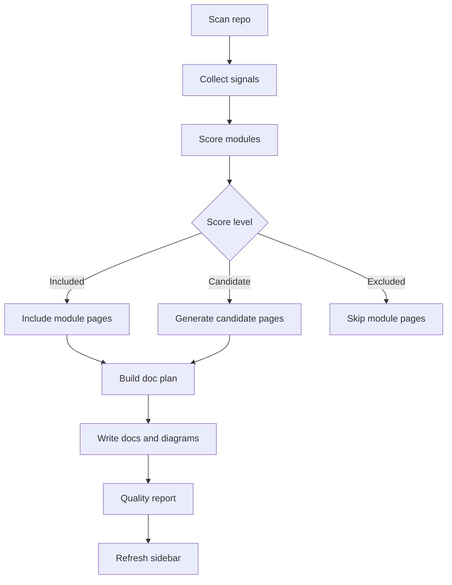

# Codewiki Generator

Generate DeepWiki-style documentation sites for any codebase.

## Core Principles

| Principle | Meaning |
|-----------|---------|
| **Code-first** | Code is truth, docs are secondary |
| **Visual-first** | Mermaid diagrams over walls of text |
| **Insightful** | Explain why, not just what |

## Quick Start

```bash
# 1. Bootstrap codewiki directory
python <skill-root>/scripts/codewiki_bootstrap.py \
    --repo-root <target-repo> \
    --out-dir codewiki \
    --force

# 2. Launch the doc site
npm --prefix codewiki install
npm --prefix codewiki run docs:dev
```

## Strong Mode (Evidence-driven)

```bash
python <skill-root>/scripts/codewiki_analyze.py \
    --repo-root <target-repo> \
    --out-dir codewiki \
    --force \
    --refresh-sidebar
```

Outputs:
- `codewiki/.meta/` (deps, entrypoints, evidence, doc plan, symbols)
- `codewiki/quality-report.md`

Optional (for deeper symbols):
```bash
brew install universal-ctags
```

## How It Works (Evidence Scoring)

Strong mode converts code evidence into a doc plan with scores and confidence levels.

- Evidence rules live in `references/evidence-rules.json` and define weighted signals
- Each module gets a score and status: `included`, `candidate`, or `excluded`
- Candidate pages are generated but clearly marked as low-confidence
- Symbols are extracted via `ctags` when available and written to `symbols.json`
- Metadata and quality reports make the decision process auditable



## Generated Structure

```
codewiki/
├── overview.md              # Project overview
├── getting-started/         # Quickstart guide
├── architecture/            # Architecture design
├── core-components/         # Core components
├── development/             # Development guide
└── .vitepress/              # VitePress config
```

## Module Selection

**Required**: overview, getting-started, architecture, core-components, development

**Conditional** (evidence-scored): api-reference, plugins, build-and-release, security, observability, etc.

See [structure-and-heuristics.md](references/structure-and-heuristics.md) for details.
