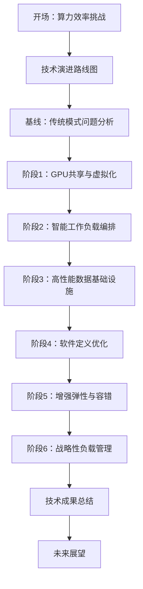
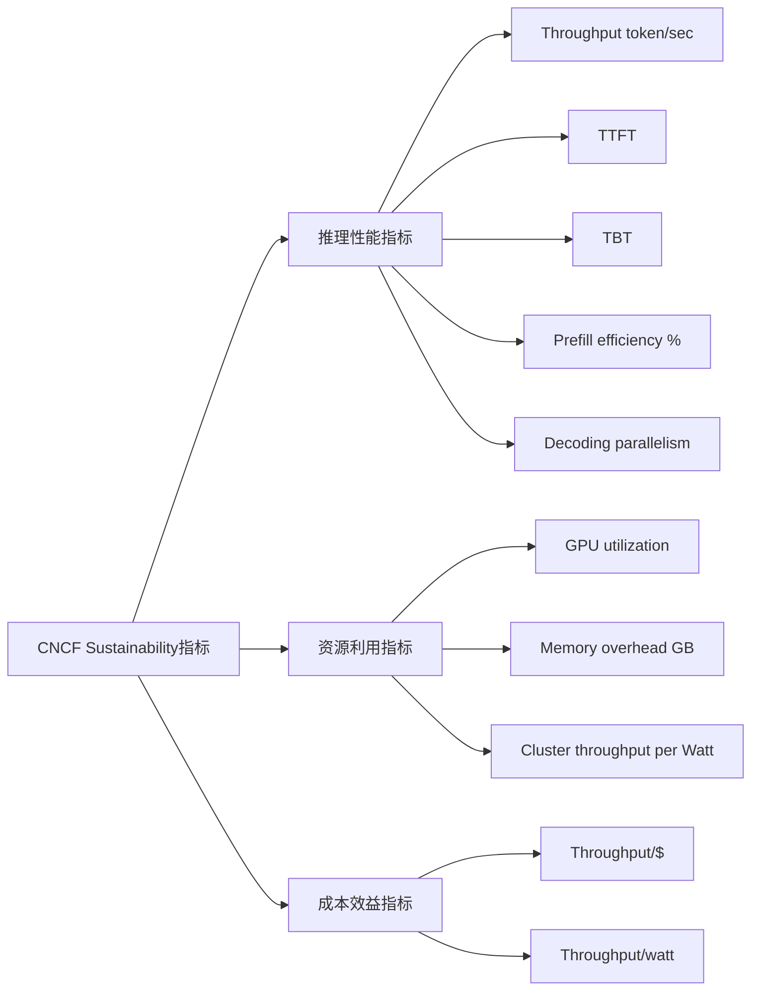

# GPU算力效率提升PPT设计文档

## 概述

本设计文档详细规划了一份技术导向的PPT演示文稿，系统展示GPU算力效率提升的六个技术发展阶段。PPT采用渐进式技术演进的叙事结构，从传统裸金属基线开始，逐步展示先进的GPU管理、调度优化和智能化运维技术，最终实现24/7高效算力利用。

## 架构

### PPT整体架构设计



### 技术指标体系架构



## 组件和接口

### 1. PPT页面结构设计

#### 开场部分 (3页)
- **第1页：标题页**
  - 主标题：GPU算力效率提升的技术演进之路
  - 副标题：从传统裸金属到智能化算力管理的六大技术突破

- **第2页：算力效率挑战概述**
  - 技术要点：
    - 传统GPU利用率低下问题（<30%平均利用率）
    - 资源碎片化严重
    - 多租户场景下的资源冲突
    - 大模型训练和推理的算力需求激增

- **第3页：技术演进路线图**
  - 技术要点：
    - 六个阶段的技术发展时间线
    - 每个阶段的核心技术突破点
    - 效率提升的量化指标对比

#### 基线分析 (2页)
- **第4页：传统裸金属租赁模式分析**
  - 技术要点：
    - 独占式GPU分配模式
    - 资源利用率统计数据
    - 成本效益分析

- **第5页：问题根因技术分析**
  - 技术要点：
    - GPU资源粒度过粗问题
    - 调度算法局限性
    - 缺乏动态资源管理机制

#### 阶段1：GPU共享与虚拟化 (4页)
- **第6页：GPU分片技术架构**
  - 技术要点：
    - NVIDIA MIG (Multi-Instance GPU) 技术原理
    - GPU内存和计算单元的物理分割
    - 硬件级别的隔离保证

- **第7页：时间共享与vGPU实现**
  - 技术要点：
    - NVIDIA MPS (Multi-Process Service) 机制
    - HAMi vGPU虚拟化技术
    - 时间片调度算法优化

- **第8页：GPU Right-Sizing策略**
  - 技术要点：
    - 基于分析的资源配置方法
    - 基于Profiling的动态调整
    - SLM (Small Language Model) 资源需求分析

- **第9页：阶段1效果量化**
  - 技术要点：
    - GPU承载能力提升倍数
    - 资源利用率改善数据
    - 成本降低百分比

#### 阶段2：智能工作负载编排 (5页)
- **第10页：Binpack调度策略深度解析**
  - 技术要点：
    - 多维资源装箱算法
    - GPU、CPU、内存的联合优化
    - 碎片化最小化算法实现

- **第11页：动态批处理技术**
  - 技术要点：
    - 实时负载感知批处理
    - 自适应批大小调整
    - 延迟与吞吐量平衡策略

- **第12页：集群调度架构**
  - 技术要点：
    - Kubernetes原生调度器扩展
    - 多级调度队列设计
    - 资源预留和抢占机制

- **第13页：公平控制器实现**
  - 技术要点：
    - 多租户资源配额管理
    - 优先级队列调度
    - 资源借用和回收机制

- **第14页：阶段2性能提升数据**
  - 技术要点：
    - 资源碎片化减少百分比
    - GPU集群整体利用率提升
    - 多租户效率优化效果

#### 阶段3：高性能数据基础设施 (4页)
- **第15页：RDMA网络架构**
  - 技术要点：
    - InfiniBand/RoCE网络拓扑
    - RDMA over Converged Ethernet实现
    - 低延迟数据传输优化

- **第16页：并行文件系统设计**
  - 技术要点：
    - Lustre分布式文件系统
    - 并行I/O性能优化
    - 元数据服务器集群

- **第17页：GPUDirect Storage技术**
  - 技术要点：
    - GPU直接存储访问机制
    - 绕过CPU的数据路径优化
    - NVMe-oF存储集成

- **第18页：数据传输性能突破**
  - 技术要点：
    - 带宽利用率提升数据
    - 延迟降低统计
    - GPU数据饥饿问题解决效果

#### 阶段4：软件定义优化 (4页)
- **第19页：LLM推理加速技术栈**
  - 技术要点：
    - PagedAttention内存管理
    - KV缓存复用机制
    - Prefill/Decode分离架构

- **第20页：推理性能优化实现**
  - 技术要点：
    - 动态批处理优化
    - 序列长度自适应调整
    - 内存池管理策略

- **第21页：训练效率提升技术**
  - 技术要点：
    - 梯度累积优化
    - 混合精度训练
    - 分布式训练通信优化

- **第22页：CNCF性能指标达成**
  - 技术要点：
    - Throughput (token/sec) 提升数据
    - TTFT和TBT优化效果
    - GPU utilization和Memory overhead改善

#### 阶段5：增强弹性与容错 (3页)
- **第23页：智能弹性伸缩架构**
  - 技术要点：
    - 基于负载预测的自动扩缩容
    - GPU资源池动态管理
    - 多云资源协调调度

- **第24页：容错训练框架**
  - 技术要点：
    - 异步检查点机制
    - 分布式容错算法
    - 故障快速恢复策略

- **第25页：停机时间最小化效果**
  - 技术要点：
    - 故障恢复时间统计
    - 有效计算时间提升
    - 训练任务成功率改善

#### 阶段6：战略性负载管理 (3页)
- **第26页："白天推理，夜间训练"策略**
  - 技术要点：
    - 时间维度负载调度
    - 推理和训练工作负载特征分析
    - 资源利用率时间分布优化

- **第27页：地理和时间优化**
  - 技术要点：
    - 多地域算力资源协调
    - 时区差异利用策略
    - 全球负载均衡算法

- **第28页：24/7高利用率实现**
  - 技术要点：
    - 闲置容量利用统计
    - 持续高利用率维持机制
    - 成本效益最大化效果

#### 总结部分 (3页)
- **第29页：技术成果综合展示**
  - 技术要点：
    - 六个阶段的累积效果
    - 关键性能指标对比
    - 技术创新点总结

- **第30页：行业影响与价值**
  - 技术要点：
    - 算力成本降低效果
    - 能源效率提升贡献
    - 技术标准化推进

- **第31页：未来技术展望**
  - 技术要点：
    - 下一代GPU架构适配
    - AI原生调度技术
    - 量子-经典混合计算

## 数据模型

### 性能指标数据结构

```yaml
PerformanceMetrics:
  推理性能:
    throughput_tokens_per_sec: number
    ttft_milliseconds: number
    tbt_milliseconds: number
    prefill_efficiency_percent: number
    decoding_parallelism: number
  
  资源利用:
    gpu_utilization_percent: number
    memory_overhead_gb: number
    cluster_throughput_per_watt: number
  
  成本效益:
    throughput_per_dollar: number
    throughput_per_watt: number
    
  阶段对比:
    baseline: PerformanceMetrics
    stage1: PerformanceMetrics
    stage2: PerformanceMetrics
    stage3: PerformanceMetrics
    stage4: PerformanceMetrics
    stage5: PerformanceMetrics
    stage6: PerformanceMetrics
```

### 技术模块数据结构

```yaml
TechnicalModule:
  name: string
  stage: number
  key_technologies: array[string]
  implementation_details: object
  performance_impact: PerformanceMetrics
  integration_points: array[string]
```

## 错误处理

### 内容组织错误处理
- 技术深度不足时，提供更详细的技术实现说明
- 性能数据缺失时，提供估算方法和行业基准
- 技术模块关联性不清时，补充架构图和流程图

### 材料整合错误处理
- 现有材料不匹配时，提供适配建议
- 技术描述不准确时，提供修正方案
- 展示逻辑不清晰时，重新组织结构

## 测试策略

### 内容验证测试
- 技术准确性验证：确保所有技术描述符合实际实现
- 逻辑连贯性测试：验证六个阶段间的技术演进逻辑
- 性能数据一致性：确保各阶段性能提升数据的合理性

### 展示效果测试
- 技术深度适宜性：确保技术内容既专业又易于理解
- 视觉呈现效果：验证图表和架构图的清晰度
- 时间控制测试：确保内容量适合预定的演讲时长