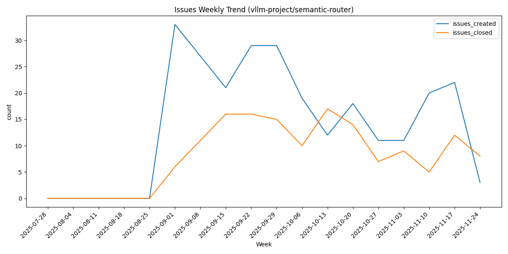
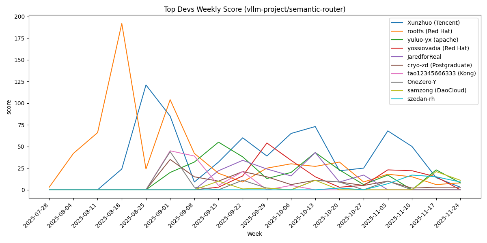

# GitHub Repo Activity Analyzer

Analyze GitHub repository maintenance health over a time window and generate weekly trends and top developer contribution charts.

## Overview
- Window: default 30 days (UTC, weeks start on Monday)
- Signals:
  - Activity: commits, active contributors, bus factor (top commit share)
  - Issues & PRs: weekly created/closed/merged counts
  - Releases & archive: latest release age, archived flag
  - Top developers: weekly weighted score (3×commits + 2×opened PRs + 1×opened issues)

## Metrics Definitions & Formulas

### 1. Totals
Basic counts over the selected time window (default 30 days).
*   **commits**: Total number of commits to the default branch.
*   **issues**: Total number of issues created (excluding PRs).
*   **prs**: Total number of pull requests created.
    *   *Note: Bots are excluded from these counts.*

### 2. Contributors
*   **active_count**: The number of unique users who have performed at least one of the following actions in the time window:
    *   Committed code
    *   Opened an Issue
    *   Opened a PR
    *   *Formula*: `Count(Unique Users in {Commits U Issues U PRs})`
*   **top_commit_share**: The percentage of total commits made by the single most active committer. A high number (>0.7) indicates a "Bus Factor" risk.
    *   *Formula*: `Max(Commits per User) / Total Commits`

### 3. Quality (Rates)
Ratios indicating the responsiveness and throughput of the repository.
*   **issue_close_rate**: The ratio of closed issues to total issues (opened + closed) in the window.
    *   *Formula*: `Closed Issues / Total Issues (in window)`
*   **pr_merge_rate**: The ratio of merged PRs to total PRs (opened + closed + merged) in the window.
    *   *Formula*: `Merged PRs / Total PRs (in window)`
*   **pr_close_rate**: The ratio of closed (but not merged) PRs to total PRs.
    *   *Formula*: `Closed (Unmerged) PRs / Total PRs (in window)`

### 4. Top Developers Score
A weighted activity score used to rank the top 10 contributors.
*   **Score Formula**: `(3 × Commits) + (2 × Opened PRs) + (1 × Opened Issues)`
*   *Rationale*: Code contributions are weighted highest, followed by PRs (intent to contribute), and then Issues (reporting/discussion).

### 5. Health Status
A simple heuristic to flag potential risks.
*   **healthy**: Active contributors > 0 AND top_commit_share <= 0.7
*   **at_risk**: Active contributors == 0 OR top_commit_share > 0.7

## Requirements
- Python 3
- Optional `GITHUB_TOKEN` to raise GitHub API rate limits
- `matplotlib` for `--plot` charts (required when plotting)

## Usage
```
python tools/analyze_github_repo.py --repo <owner/repo>
python tools/analyze_github_repo.py --repo <owner/repo> --plot
```

Options:
- `--days N` set window length (default: 30)
- `--json` print structured summary
- `--plot` generate PNG charts

Environment:
- `GITHUB_TOKEN` Personal Access Token to increase API rate limits

## Example: vllm-project/semantic-router

### Generated charts:

Issues Weekly Trend



PRs Weekly Trend


Top Devs Weekly Score



Notes:
- PRs chart includes a second axis for average PR close time (days)
- Charts are computed over the selected window with bot users filtered

